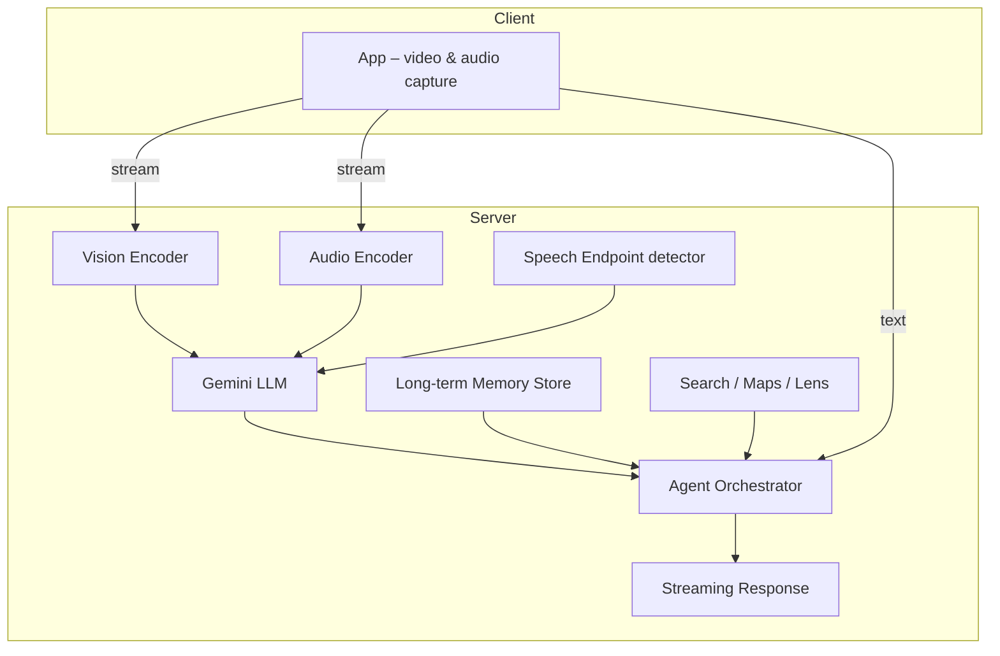

# Project Astra – Gedetailleerde Samenvatting

> **Context**
> Podcast‑gesprek (± 48 min) tussen **Hannah Fry** en **Greg Wayne** (Director of Research, Google DeepMind) over **Project Astra**: een onderzoek‑prototype voor een universele multimodale AI‑assistent.

---

## 1. Wat is Project Astra?

| Aspect                          | Beschrijving                                                                                                                                                                                          |
| ------------------------------- | ----------------------------------------------------------------------------------------------------------------------------------------------------------------------------------------------------- |
| **Doel**                        | Een “AI‑papegaai op je schouder” die **ziet, hoort, onthoudt en spreekt** en overal met je mee‑loopt—via phone, computer, VR‑bril of smartglasses.                                                    |
| **Kern­functies**               | • Live camera‑zicht (visie)  • Native audio‑invoer (geen tussenstap spraak‑naar‑tekst)  • Real‑time conversatie  • Contextueel langetermijn‑geheugen  • Redeneervermogen  • Multilingual (± 20 talen) |
| **Onderliggende intelligentie** | Gebouwd **op Gemini** + aanvullende modellen en een “agent‑laag” die tools (Search, Lens, Maps), geheugen en pro‑actieve logica aanstuurt.                                                            |
| **Jaardoel**                    | Een “proto‑AGI” laten zien—een systeem waarvan experts zouden zeggen dat échte AGI nu onafwendbaar is.                                                                                                |

---

## 2. Demonstratie‑momenten

1. **Objectherkenning**

   * Herkent Escher‑illustratie → raadt het boek *Fermat’s Last Theorem*.
   * Identificeert een model van de *linker* hersenhelft.
2. **Visuele beschrijving**

   * Vat tekeningen op een whiteboard samen (bomen, gebouwen, muzieknoten).
3. **Multilingual chat**

   * Schakelt ongevraagd tussen Engels, Frans en Russisch; herkent code‑switching.
4. **Contextueel geheugen**

   * Kent Greg bij naam; herinnert eerdere sessies.
5. **Humor & persoonlijkheid**

   * Reageert op complimenten (“nice furniture”), vertoont “agreeableness”.

---

## 3. Technologie & Architectuur

* **Co‑locatie** van encoders en LLM in dezelfde GPU‑cluster reduceert latency.
* **Native audio** → direct akoestisch patroon naar de LLM; betere accenten & zeldzame namen (“Demis Hassabis” ≠ “Damascus”).
* **Speculatieve respons‑planning**: model begint antwoord te formuleren vóórdat de spreker klaar is.
* **In‑session geheugen**: ± 10 min visuele/audio “filmstrook” (1 fps ≈ 600 frames).
* **Offline geheugen**: na afloop automatische samenvatting in twee sporen

  1. **Persoons­profiel** (stabiele voorkeuren)
  2. **Sessie‑log** (tijdstempel + gespreksthema’s)

---

## 4. Gebruik & Testers

| Scenario                      | Voorbeeld                                                                              |
| ----------------------------- | -------------------------------------------------------------------------------------- |
| **Trusted Testers**           | Mode‑advies: “Wat past bij deze outfit?”                                               |
| **Toegankelijkheid**          | Visuele begeleiding voor slechtzienden; herkennen van obstakels, tekst‐voor‐lezen.     |
| **Taal­leren**                | Objecten aanwijzen en direct vocabulaire oefenen in straat‑context.                    |
| **Calorie‑schatting**         | Teller bij maaltijd: “7 spruitjes + pork loin = … kcal”.                               |
| **Proactieve hulp (roadmap)** | Herinnert aan lege sinaasappelsap bij thuiskomst; zal via video zelf context afleiden. |

---

## 5. Latency & Doorbraken

| Stap                  | Verbetering                                                                                                                                    |
| --------------------- | ---------------------------------------------------------------------------------------------------------------------------------------------- |
| Hackathon (1e versie) | 7 s vertraging per antwoord.                                                                                                                   |
| Nu (prototype)        | Sub‑seconde respons dankzij <ul><li>Gestreamde videoframes</li><li>Endpointing (precies einde spraak)</li><li>Speculatieve generatie</li></ul> |

---

## 6. Redenatie & Limitaties

* **Redeneren**: hoofdzakelijk intern in het neurale netwerk; beperkte “inner speech”.
* **Geluid‑scheiding** (“cocktail‑party‑problem”): nog lastig in rumoer; multimodale cues (lip‑beweging) gepland.
* **Agreeableness bias**: soms “ompraten” door bemoediging.
* **Vrijblijvende fouten**: weigert soms onterecht te lezen → na aansporing wel.

---

## 7. Ethiek, Privacy & Veiligheid

| Maatregel                    | Uitleg                                                                                          |
| ---------------------------- | ----------------------------------------------------------------------------------------------- |
| **Gebruikers­controle**      | Volledige inzage en wissen van opgeslagen herinneringen → geheugen wordt dan opnieuw opgebouwd. |
| **Heuristieken voor opslag** | Onthoudt expliciete “Remember this …” en nieuwe voorkeuren; anders samenvatting.                |
| **Safety‑filters**           | Blokkeert NSFW‑beelden, ongepaste verzoeken en model‑output.                                    |
| **Red‑teaming & Ethicists**  | Samenwerking met interne/externe onderzoekers (o.a. Iason Gabriel) voor adversarial tests.      |

---

## 8. Toekomstige Richting (6‑12 mnd)

1. **Proactive Video** – continu meekijken & waarschuwen (navigatie, object‑herkenning).
2. **Full‑Duplex Audio** – tegelijk luisteren en tussenzinnetjes (“uh‑huh”) teruggeven.
3. **Diepere reasoning & tool‑calls** – meerlagig onderzoek, complexe queries.
4. **Uitgebreider geheugen** – langere context, “reflection” op gebeurtenissen.
5. **Hardware‑diversiteit** – VR‑headsets & wearables; uiteindelijk fysiek embodiment.

---

## 9. Historisch Traject

| Jaar           | Moment                                                                      |
| -------------- | --------------------------------------------------------------------------- |
| \~2021         | DeepMind‑challenge: “Bouw een Proto‑AGI”.                                   |
| 2 wk hackathon | Eerste “Astra” met ruwe multimodale prompt + 7 s latency.                   |
| 2024           | Integratie Gemini; native audio; publiek I/O‑demo (45 s → 10 min geheugen). |
| 2025           | Vertrouwelijke testers wereldwijd; podcast‑onthulling.                      |

---

## 10. Conclusie

Project Astra laat zien **hoe snel multimodale, contextbewuste AI‑agents evolueren**—van trage demo naar quasi‑real‑time “sidekick” in amper enkele jaren. Het systeem combineert:

* **Zintuiglijke perceptie** (camera+microfoon)
* **LLM‑redenering** (Gemini)
* **Tool‑integratie & geheugen**
* **Mens‑gerichte UX** (spontaan, meertalig, laag latency)

Hoewel nog géén AGI, **verschuift de lat** voor wat we van een digitale assistent verwachten: niet langer reactie op commando’s, maar **co‑presentie en samenwerking in de echte wereld**.
